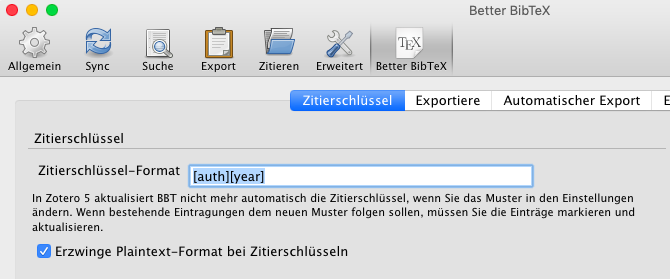
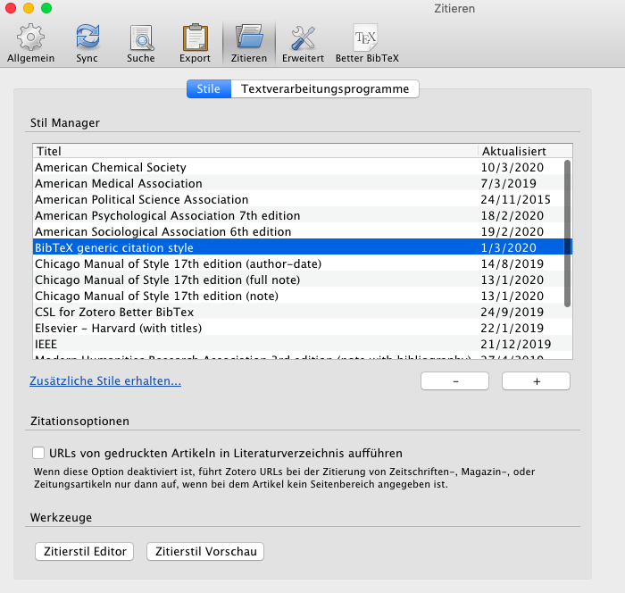
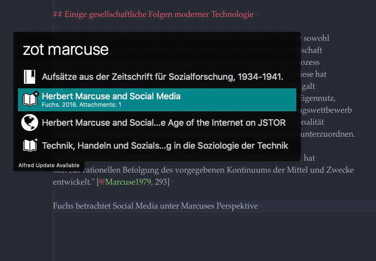

In the past few months I was trying to figure out, how to organize myself in academia for my studies. Especially I wanted to find a neat workflow to quickly take notes during lectures, organize literature and write papers, while not having to deal too much with tedious formatting of citations in specific citation styles or having to struggle with the layout of word documents. Meanwhile I have found a setup, which works pretty well for me. In this post I will have an indepth look at it, while trying to explain everything in a way that is also understandable by non-techies.

Before going into details, here is an overview of tools I use:

- [Atom.io](https://atom.io/) editor (to take lecture notes or write papers in [Markdown](https://en.wikipedia.org/wiki/Markdown))
- [Zotero](https://www.zotero.org) (reference manager) with:
    - Zotero Connector (to import references, integrated in Zotero)
    - [Better BibTex-Addon](https://retorque.re/zotero-better-bibtex/) for Zotero (to generate better citekeys)
- [AlfredApp](https://www.alfredapp.com/) (launcher for Mac) with:
    - [ZotHero-Plugin](https://github.com/deanishe/zothero) (to access Zotero references on the fly)
    - A custom workflow to search Worldcat.org from Alfred
- [Pandoc](https://pandoc.org/) (to convert markdown to Word/PDF/HTML)
- [Scrivener](https://www.literatureandlatte.com/scrivener/overview) (to write longer essays, papers or thesis)
- [R-Studio](https://rstudio.com/) with [Blogdown-Package](https://github.com/rstudio/blogdown) & [Github](https://github.com/) as hosting platform (for blogging)

I will not cover Scrivener and R-Studio/Blogdown in this post (maybe in a follow up). But let's break the rest of it down into parts.

# What is Markdown?

Markdown is a lightweight markup language for text-formatting. If you never heard about it, maybe you are familiar with the formatting of whatsapp-messages: You can use asteriks `*to make text bold*` or underlines `_to make text italic_`. The syntax in markdown is a bit different, but the principle is the same. Except that markdown is way more powerful.

Let's have a look at the following markdown-code:

```

# This is a level-one heading

This is some random paragraph with **bold** and *italic* words.

[This is a link](http://www.to_url.com)

## This is a level-two heading

This is a list:

- Item 1
- Item 2
- Item 3

```

When this markdown code is rendered to HTML, it will look like this:


Why did I chose markdown? Here are a few reasons:

- I wanted my note-taking and writing system to be as **lightweight** as possible. This means: plain text files, my own folder structure, lightweight editors, no endless clicking around, no painful formatting of documents.
- I wanted my environement to be **independent** from specific software and use as much open formats and software as possible (I used Evernote before to take notes during my bachelor studies, which has it's advantages too, but then you are stuck with that specific software)
- It's **powerful**. In combination with other tools like Pandoc, markdown can be converted to other documents like PDF/Word/HTML and others, while cited references get resolved or even linked automatically in your prefered citation style (we'll get into that later).

If you want to learn markdown, you might want to check [www.markdownguide.org](https://www.markdownguide.org/) or [www.markdowntutorial.com](https://www.markdowntutorial.com/). Also, if you want to give markdown a quick try, you can use this online markdown editor: [dillinger.io](https://dillinger.io/).

To explain all the steps from markdown to formated paper with citations and bibliography in the prefered style, let's have a look at an example.

# Writing papers in Markdown

My favourite editor for text is [Atom.io](https://atom.io/). Atom is not a dedicated markdown-editor but rather a very sophisticated and extendable editor mostly used for computer programming. It is tweakable for distraction free markdown-writing with atom-packages like [Zen](https://atom.io/packages/Zen), [Typewriter](https://atom.io/packages/Typewriter) and [Wordcount](https://atom.io/packages/Wordcount). If you don't want to use Atom, there are plenty other dedicated markdown editors, like the fancier [Ulysses](https://ulysses.app/) or the minimal [ByWord](https://bywordapp.com/) for Mac.

Back to the specific example. While writing, my response paper will look something like this in Atom:


The section on top (with the title, subtitle and author attributes) is a YAML-header. This is not part of native markdown syntax. It is used for transforming the paper to othter formats with Pandoc - we'll get to this later. Before that, let's have a look on how to manage references.

# Managing references with Zotero

[Zotero](https://www.zotero.org/) is a free and open-source reference management software to manage bibliographic data and related research materials. Zotero knows different types of references like books, book sections, journal articels, webpages and more. Also you can save your PDF's directly into Zotero.


On of it's strenghts is the easyness of reference collection. If you have a collection of existing PDF's, you can drag & drop them into Zotero and it will attempt to resolve the reference automatically by using the document metadata and online catalogues.

Another way of getting references into Zotero is with the [Zotero Connector](https://www.zotero.org/download/connectors). With this browser addon you can import references into Zotero directly from your browser while searching catalogues. Need that journal article from JSTOR? It's only one click away:


And if the publication is open access or accessible for your university network, Zotero will not only import the reference but also the article as PDF:


Now that we have our references in Zotero, how can we get them into our markdown code?

# Access references from Markdown

In order to access our Zotero references, they have to be identifiable by a unique citekey. As far as I know, Zotero provides this somehow by default, but it is recommended to use an add-on called [Better BibTex](https://retorque.re/zotero-better-bibtex/): "Better BibTex makes it easier to manage bibliographic data, especially for people authoring documents using text-based toolchains (e.g. based on LaTeX / Markdown)." (from the official website).

Better BibTex needs to be configured in Zotero (`Zotero->Preferences->Better BibTex`). The most important setting is the format of the citekey. I use the following:



This will generate an unique citekey for every reference:


This keys we will use in our markdown code to create citations. The format for a citation uses square brackets and an @ before the citekey, eg.:`[@citekey]`. To access Marcuses book displayed in the screenshot on top, we would use `[@Marcuse1979]`. If we want to cite a specific page within the book, we can add a semicolon and a page number. In Atom this looks as follows:


Fair enough, we have referenced Marcuse. But with the current setup, we still have to switch back and forth between Zotero and our markdown editor, remember the citekey and then manually write it down in markdown. Wouldn't it be easier  access the Zotero references on the fly from our markdown editor? Let's have a look at Alfred and the ZotHero plugin.

# From Zotero to Markdown with Alfred

[Alfred](https://www.alfredapp.com/)  is an univeral launcher app for Mac. It is basically used by nerds like me to access everything on their computer without using the mouse. The default keyboard shortcut to open the Alfred launcher from everywhere on a Mac is `Cmd ⌘ + Space`. When the launcher is opened, you can access apps, find files or do countless other things. As an example, that's how it looks like when I want to start or open Zotero with Alfred:


The paid version of Alfred is extendable with plugins and workflows. I use a plugin called[ZotHero](https://github.com/deanishe/zothero) in order to access my Zotero references through Alfred. ZotHero allows full-text search across your Zotero database. It also allows you to copy citations or formatted references in a specific [citation style](https://en.wikipedia.org/wiki/Citation_Style_Language). Unfortunately the paid version of Alfred is needed for ZotHero.

> **Warning:** *This part is a bit experimental and a workaround. If you have a better solution, let me know.*

>Zotero uses to uses specific citation styles (CSL-files) to format citations in APA, MLA, Chicago or other styles. The problem I encountered was, that I didn't want ZotHero to provide me a neatly formated citation in APA or MLA, but rather a generic citation key for Pandoc as seen before (`[@citekey]`). So I tweaked an existing CSL file to format citations in that way. This is a **hack** and problems might occur: Better BibText removes german Umlauts like ä/ö/ü - but with CSL this is not possible as far as I know. So, from a referenc by author "Spät" of year 2016, Better BibTex will create the citekey `Spaet2016` but the ZotHero workaround will create `Spät2016`. Pandoc will not be able to resolve this, so you have to be aware and correct it manually while writing, which is a bit ugly.

>Alternatively you could ditch Alfred completely and use another solution like the [ZotPick Applescript](https://github.com/davepwsmith/zotpick-applescript) as descriped in [this post](https://raphaelkabo.com/blog/posts/markdown-to-word/).

Long story short, if you want to use my hack and Alfred, you can download the CSL-file [here](bibtex-style.csl). You then have to add it to Zotero (`Zotero->Preferences->Citations`):



After adding it to Zotero, you need to make it the default CSL for ZotHero:


By now, you should be able to search your Zotero references directly from Alfred and generate a citekey. This means, in Atom you can open Alfred with `Cmd ⌘ + Space`, then type the shortcut `zot` to start searching your Zotero database, followed by your search term:



When you found the reference, you can copy the citekey to clipboard with `Cmd ⌘ + Enter` and paste it into your editor:


Yay. But wait. Right now you probably still think: *"Why all this struggle? I could have done this much easier in Word."* Let's dive into the fun part.

# Converting Markdown to Word with Pandoc

Let's recap: We have a paper written in markdown with unique citekeys pointing to our references managed in Zotero. But it's still in makdown and can't be submitted like this. So let's convert it to Word and/or PDF with [Pandoc](https://pandoc.org/MANUAL.html).

In order to do this you need to 1) install Pandoc and 2) tell Better BibTex for Zotero to permanently export and update your reference library as a `*.bib`-File.

Firstly, to install Pandoc, follow the [installation instructions](https://pandoc.org/installing.html) on the official website.

Secondly, open your Better BibTex preferencens in Zotero and switch to the tab "Automatic Export" (`Zotero->Preferences->Better BibTex->Automatic Export`). Setup the automatic export to a path, which you remember (you need this for Pandoc) and set it to automatically update on change:


You are now ready to use Pandoc. Pandoc is basically run from the command line. If you don't want to call Pandoc from terminal, you can use Automator (built-in with every Mac) with the `Run shell script`-block to create an application to drag & drop markdown files onto for conversion.

For command line conversion I use this:

```
$ pandoc my_document.md
-s
--from markdown+smart+escaped_line_breaks
--to docx
--resource-path ./
--filter pandoc-citeproc  
--bibliography /path/to/your/library.bib
--csl /path/to/your/citation_style.csl
--reference-doc /path/to/your/word_template.docx
-o output.docx
```
Let's have a look at the arguments:

- `my_document.md` - the markdown file you want to convert
- `-s` - use standalone mode
- `--from markdown+smart+escaped_line_breaks` - the source format is markdown (with some tweaks)
- `--to docx` - We want a Word document as the target format
- `--resource-path ./` - search the current folder for ressources (eg. linked images in markdown code)
- `--filter pandoc-citeproc` - use pandoc-citeproc as filter. This will convert the citekeys to neatly formatted citations and ad a bibliography at the end of the resulting word document
- `--bibliography /path/to/your/library.bib`- this path must point to the bibliography file that we just created from Better BibTex with the automatic export
- `--csl /path/to/your/citation_style.csl` - points to a CSL-file with the desired style definition (eg. APA, MLA , Chicago or a specific style used by your university). I use [this CSL](uni-basel-soziologie.csl) which I tweaked to match (hopefully) the guidelines of the sociological institute of the University of Basel. You can find general information about styles on [citationstyles.org](https://citationstyles.org/) and specific styles on the [CSL style repository on Github](https://github.com/citation-style-language/styles) or the [Zotero style repository](https://www.zotero.org/styles)
- `--reference-doc /path/to/your/word_template.docx`- optionally, you can use a word template, which will be used to format your document. I use [this one](pandoc-template-essay.docx) provided by a nice tool called *Docdown* by [Raphael Kabo](https://raphaelkabo.com/blog/posts/introducing-docdown/), which actually bundles all of this Pandoc conversion done here in a small app. If you don't want to mess with the terminal app, use this. Actually a lot of what I do here is inspired by [Raphaels](https://raphaelkabo.com/blog/posts/markdown-to-word/) [posts](https://raphaelkabo.com/blog/posts/introducing-docdown/).
- `-o output.docx` - the name of the resulting file

Let's call Pandoc now to convert the paper. That's what it will look like at the end:


Here we go, a nicely formatted paper. From Word you can create a PDF as usual (it could be done directly with Pandoc too, but I usually do it via Word). In the same way I used Pandoc to create a Word document now, it could also be used to create HTML or again a markdown document but with resolved citations and a bibliography in a specific citation style. This allows me to transform the same markdown document 1) to a PDF for submission to a lecturer and 2) to a publishable markdown document for my blog, like I did with my [essays](../../categories/essays). But more on that probably in a later post.
