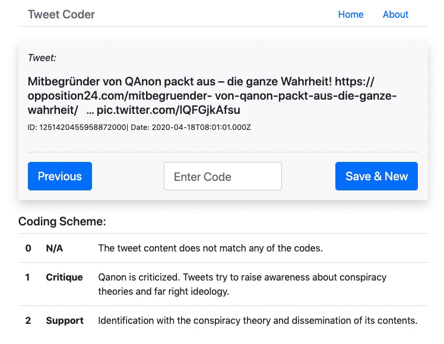

```{r setup, include=FALSE}
knitr::opts_chunk$set(echo = TRUE)
```

Die durch die COVID-19-Pandemie verursachte globale Unsicherheit, führte zu einer zunehmenden Verbreitung von Verschwörungstheorien, darunter die rechtsextreme und trumpistische Verschwörungstheorie [QAnon](https://de.wikipedia.org/wiki/QAnon)[^qanon].

[^qanon]: Siehe dazu z.B. [“QAnon” – der Aufstieg einer gefährlichen Verschwörungstheorie](https://www.rnd.de/politik/qanon-der-aufstieg-einer-gefahrlichen-verschworungstheorie-ORTPE4D5YRFRZKVTMJBTFADJTY.html), Redaktionsnetzwerk Deutschland, 1. April 2020, abgerufen am 18. August 2020 oder [ Die Verschwörungsfanatiker von QAnon.](https://www.youtube.com/watch?v=9R5TvLCsN-E), Der SPIEGEL, 4. August 2020, abgerufen am 18. August 2020

In diesem Beitrag wird untersucht, ob sich solche Tendenzen in Twitter-Daten erkennen lassen. Dazu wurden Tweets gesammelt, welche sich auf QAnon beziehen und während des Lockdowns abgesetzt wurden. Basierend auf diesem Dataset erfolgt einerseits eine Gegenüberstellung zu der Zunahme von COVID-19-Fällen im gleichen Zeitraum. Andererseits wird mittels Machine Learning durch eine nonparametrische, automatisierte Inhaltsanalyse mit [readme2](https://github.com/iqss-research/readme-software) eine Einschätzung darüber abgegeben, wieviele der Tweets sich  affirmativ bzw. kritisch auf QAnon beziehen.

### Die Twitter-Daten

Das Dataset besteht aus 11'363 deutschsprachigen Tweets aus dem Zeitraum 1. Februar 2020 bis 24. April 2020, welche sich entweder durch das Schlagwort "QAnon" oder "wwg1wga" (ein Leitspruch und Codewort der Anhänger\*innen, stehend für "where we go one, we go all" - der autoritäre Charakter kondensiert in einen Hashtag?!) auf QAnon beziehen. Diese wurden mit dem Python-Skript [TweetScraper](https://github.com/jonbakerfish/TweetScraper) aggregiert, in einer lokalen [MongoDB](https://www.mongodb.com/)-Datenbank gespeichert und nach der Codierung (siehe unten) als JSON-Dump exportiert ([hier](qanon_dump.json).

## Zunehmende COVID-19-Fälle vs. Anzahl QAnon-Tweets

Zunächst soll überprüft werden, ob in den Daten tatsächlich eine Zunahme von QAnon-Tweets während der Corona-Pandemie feststellbar ist. Dafür werden die Anzahl Tweets pro Tag der Anzahl COVID-19-Fälle in der Schweiz, Deutschland und Österreich im gleichen Zeitraum gegenübergestellt.

Lesen wir die Daten ein:

```{r libraries, echo=FALSE, include=FALSE}
rm(list=ls())
#devtools::install_github("iqss-research/readme-software/readme")
library(mongolite)
library(jsonlite)
library(tidyverse)
library(magrittr)
library(lubridate) 
library(foreach)
library(plotly)
library(reshape2)
library(jsonlite)
library(tensorflow)
library(readme)
#remotes::install_github("joachim-gassen/tidycovid19")
library(tidycovid19)
```

```{r read_data}
# Load the data from dump-file
tweets <- jsonlite::stream_in(file("qanon_dump.json"), verbose = F)
```

Für die Zeitstrahl-Analyse werden die Tweets nun nach Veröffentlichkeitsdatum geordnet und gruppiert:

```{r parse_date}
# Prepare data for timeline analysis
tweets_uncoded <- tweets %>%
  filter(is.na(code)) %>% # Filter out coded tweets - the dates of these got messed up while coding unfortunately..
  mutate(
    datetime = datetime %>% 
    parse_date_time(orders = ' %Y-%m-%d %H%M%S') # Parse date
  ) %>%
  mutate(datetime = datetime + 1*60*60) %>% # Set time from UTC to CET.
  mutate(datetime = datetime %>% round(units = 'days') %>% as.POSIXct()) # Remove the time, we just need the dates
 
# What timerange do we have?
# tweets_uncoded %>% pull(datetime) %>% min()
# tweets_uncoded %>% pull(datetime) %>% max()

# Group by day
tweet_groups <- tweets_uncoded %>% group_by(datetime) %>% tally() %>% rename(date = datetime)

```

Mit dem R-Package `tidycovid19` können wir ein Dataset mit der Anzahl COVID-19-Fällen laden und diese ebenfalls nach Datum gruppieren. Da nur Tweets aus dem deutssprachigen Raum analysiert werden, berücksichtigen wir auch nur Fallzahlen aus Deutschland, Österreich und der Schweiz. Dabei werden die COVID-19-Fallzahlen für die Visualisierung proportional zur Anzahl Tweets herunterskaliert - die Messeinheit der Y-Achse stimmt also in der Grafik nur für die Anzahl Tweets, nicht aber für die COVID-19-Fallzahlen!

```{r covid_data}

# Get covid-cases via tidycovid19 package
# covid <- download_merged_data(cached = TRUE)
covid <- jsonlite::stream_in(file("covid_data.json"), verbose = F)

# German cases
covidDE <- covid %>%
  filter(iso3c == "DEU") %>%
  select(date, confirmed) %>%
  mutate(confirmed = round(confirmed/382)) %>% # Normalize case numbers proportionaly to the maximum numbers of tweets (max (max 400/day)
  mutate(
    date = date %>% 
    # Parse date.
    parse_date_time(orders = ' %Y-%m-%d')
  ) %>%
  filter(date > "2020-02-01" & date <"2020-04-25")

# Swiss cases
covidCH <- covid %>%
  filter(iso3c == "CHE") %>%
  select(date, confirmed) %>%
  mutate(confirmed = round(confirmed/71)) %>% # Normalize case numbers proportionaly to the maximum numbers of tweets (max 400/day)
  mutate(
    date = date %>% 
    # Parse date.
    parse_date_time(orders = ' %Y-%m-%d')
  ) %>%
  filter(date > "2020-02-01" & date <"2020-04-25")

# Austrian cases
covidAT <- covid %>%
  filter(iso3c == "AUT") %>%
  select(date, confirmed) %>%
  mutate(confirmed = round(confirmed/37)) %>% # Normalize case numbers proportionaly to the maximum numbers of tweets (max 400/day)
  mutate(
    date = date %>% 
    # Parse date.
    parse_date_time(orders = ' %Y-%m-%d')
  ) %>%
  filter(date > "2020-02-01" & date <"2020-04-25")

# join tweets & covid-cases
tweets_covid <- covidDE %>% 
  right_join(covidCH, by="date") %>% 
  right_join(covidAT, by="date") %>% 
  right_join(tweet_groups, by="date") %>%
  select(date, Covid_DE = confirmed.x, Covid_CH = confirmed.y, Covid_AUT = confirmed, Num_Tweets=n) # rename columns for plotly

```

Die nach Tag gruppierte Anzahl Tweets und COVID-19-Fälle können nun visualisiert werden:

``` {r plot_covid_tweets}
# "Melt" the dates for plotting
melted <- melt(tweets_covid, id="date")

# Prepare plot
plot <- ggplot(data=melted,
    aes(x=date, y=value, colour=variable)) +
    geom_line() +
    labs(title = 'Anzahl QAnon-Tweets vs. COVID-19-Fälle',
           y = 'Anzahl Tweets',
           x = 'Datum',
           subtitle = str_c("Total 11'363 Tweets aus dem Zeitraum 01.02.2020-24.04.2020",
                              "(COVID-19-Fälle sind normalisiert, Y-Achse misst nur Anzahl Tweets)"),
           colour = ""
           )

# plot it
fig <- ggplotly(plot)
fig
```

Der Plot zeigt deutlich, wie mit steigenden COVID-19-Fallzahlen auch die Anzahl abgesetzter Tweets zur QAnon-Verschwörungstheorie zunahmen. Lässt sich daraus schliessen, dass QAnon Anhänger\*innen gewonnen hat? Nicht unbedingt. Die Tweets können sich auch kritisch auf QAnon beziehen und zum Beispiel über die Gefahren der Verschwörungstheorie aufklären wollen. 

In einem weiteren Schritt soll nun durch maschinelles Lernen eine Schätzung versucht werden, wieviele Tweets sich prozentual entweder positiv auf QAnon beziehen und die Verschwörungstheorie verbreiten oder negativ und kritisch auf QAnon hinweisen.

## Automatische Inhaltsanalyse mit dem R-Package readme2

Für die maschinelle Kategorisierung kommt hier das Package [readme2](https://github.com/iqss-research/readme-software) zum Einsatz, welches einen Machine-Learning-Algorithmus für die automatische Inhaltsanalyse von Texten für die Sozialwissenschaften implementiert.

Wie andere supervised ML-Algorithmen benötigt `readme2` ein Trainingsset von Daten, mit welchen der Algorithmus trainiert wird. Dieses Trainingsset muss manuell erstellt werden, indem zunächst ein Codierschema festgelegt und dann die Tweets mit einem Code der entsprechenden Kategorie zugeordnet werden. Sobald der Algorithmus trainiert ist, kann damit via Spracherkennung eine Schätzung der Verteilung aller Kategorien in den unkategorisierten Tweets gemacht werden.

### Manuelle Codierung der QAnon-Tweets

Da ich zur Erstellung des Testsets eine relativ grosse Anzahl Tweets manuell codieren musste (ca. 10% der 11'363 Tweets) und keine Software fand, mit welcher sich das einfach und schnell bewerkstelligen lässt, habe ich dafür selbst eine minimalistische Web-App entwickelt([Github-Link](https://github.com/nomaad/tweet_codes)). Das Tool lädt zufällig einzelne Tweets aus dem gesamten Datenset, welche sich dann codieren lassen. Der Code wird dem Datensatz als Feld hinzugefügt und in MongoDB gespeichert. Damit wurden 904 Tweets jeweils einer von drei Kategorien zugeordnet (0 = nicht zuordenbar, 1 = kritisch-negativer Bezug, 2 = affirmativ-positiver Bezug). Achtung: Ich habe die Tweets in relativ schnellem Tempo alleine codiert, es können also durchaus Fehlcodierungen vorhanden sein.



### Training des readme2-Algorithmus 

Mit den codierten Tweets lässt sich nun der readme2-Algorithmus trainieren. Zur Textanalyse greift `readme2` auf word embeddings zurück, welche mit dem [GloVe-Algorithmus](http://text2vec.org/glove.html) erstellt wurden. `readme2` kommt mit englischen Worteinbettungen, ich habe deshalb für diese Analyse zunächst die deutschen Worteinbettungen von [deepset.ai](https://deepset.ai/german-word-embeddings) heruntergeladen, welche auf der deutschen Wikipedia trainiert wurden.

```{r training}

# Select the tweets which have a code
tweets_coded <- tweets %>%
  filter(!is.na(code))

# Helper function to load word embeddings
loadVecs <- function(path){
  wordVecs_corpus <- data.table::fread(path)
  wordVecs_keys <- wordVecs_corpus[[1]]## first row is the name of the term
  wordVecs_corpus <- as.matrix (  wordVecs_corpus[,-1] )  #
  row.names(wordVecs_corpus) <- wordVecs_keys
  wordVecs <- wordVecs_corpus
  rm(wordVecs_corpus)
  rm(wordVecs_keys) ## Remove the original loaded table to save space
  saveRDS(wordVecs, file = "wordVecs.rds")

  return(wordVecs)
}

## Generate a word vector summary for each document
# Use the german Wikipedia-trained GloVe word embeddings from https://deepset.ai/german-word-embeddings

# Load word embeddings.. 
# wordVecs <-loadVecs('deepset.ai.german.wikipedia.glove.txt')
# wordVec_summaries = undergrad(documentText = cleanme(tweets_coded$text), wordVecs = wordVecs)
#saveRDS(wordVec_summaries, file = "wordVec_summaries.rds")

# ..or load from cache instead
wordVec_summaries <- readRDS(file = "wordVec_summaries.rds")

```
Mit den deutschen Vektoren können 74% der Wörter in den 904 Tweets zugeordnet werden. Das scheint mir eher wenig, hat aber wohl damit zu tun, dass in den Tweets sehr viele themenspezifische Hashtags zu finden sind. Nun folgt 1) das eigentliche Training, 2) die automatisierte Kategorisierung der Testdaten und 3) der Abgleich zur Überprüfung mit den manuellen Codes der Testdaten. Schritt 1 und 2 werden direkt von der `readme()`-Funktion implementiert. Davor werden die 904 Tweets per Zufall in ein Test- und ein Trainingsset aufgeteilt. Ich mache drei Durchläufe mit jeweils unterschiedlichen Test- und Trainingssets, um einen besseren Eindruck über die Zuverlässigkeit der Schätzungen zu bekommen.

```{r training2}
# Evaluate 3 times, how accurate the estimations are with the coded trainingset
foreach(i=1:3) %do% {
  set.seed(i*123)
  
  # 1. Split coded tweets into a test and a training set
  rnd_train <- sample(c(0,1), nrow(tweets_coded), replace = T)
  tweets_coded$trainingset <- c(rnd_train)
  #length(which(tweets_coded$trainingset == 1))
  #length(which(tweets_coded$trainingset == 0))
  
  # 2. Call readme to make an estimation
  readme.estimates <- readme(dfm = wordVec_summaries , labeledIndicator = tweets_coded$trainingset, categoryVec = tweets_coded$code)
  
  # 3. Compare estimates & actual values
  # Output proportions estimate
  estimate <- readme.estimates$point_readme
  
  actual <- table(tweets_coded$code[tweets_coded$trainingset == 0])/sum(table((tweets_coded$code[tweets_coded$trainingset == 0])))
   
  # Calculate deviation of estimation from actual value in percent points
  percentages <- ((actual - estimate)/actual) * 100
}

```

Geschätzte prozentuale Anteile:

```{r estimated}
estimate
```

Tatsächliche prozentuale Anteile:

```{r actual}
actual
```

Abweichung der Schätzung vom tatsächlichen Anteil in Prozent:

```{r accuracy}
percentages
```

Es zeigt sich nach drei Durchgängen, dass mit unseren Trainingsdaten die zweite Kategorie (QAnon verbreitend/affirmativ) unterschätzt, die erste Kategorie (QAnon kritisierend/negativ) jedoch überschätzt wird. Auch die Kategorie null (nicht zuordenbar) wird tendenziell unterschätzt. Für die Interpretation ist dies bei der automatischen Kategorisierung der gesamten 11'363 Tweets zu berücksichtigen.

### Automatisierte Schätzung der Tweet-Kategorien

Nach diesem Training kann nun eine Schätzung über sämtliche Tweets versucht werden. Dazu muss erst sämtlicher Text gegen die GloVe-Embeddings analysiert werden.

```{r vectorize}
# Apply to whole dataset
tweets_all <- tweets %>%
  mutate(trainingset = ifelse(!is.na(code), 1, ifelse(is.na(code), 0, NA)))

wordVec_summaries_all = undergrad(documentText = cleanme(tweets_all$text), wordVecs = wordVecs)
```

Die unkategorisierten Tweets werden nun in einem Loop für jeden Tag im gesamten Zeitraum aufgesplittet. Für jeden Tag wird dann `readme()` aufgerufen. Schlussendlich kann so visualisiert werden, ob und wie sich die Anteile der einzelnen Kategorien mit fortschreitendem zeitlichen Verlauf verändert haben. Da die Berechnung auf meinem Rechner mehr als 3 Stunden in Anspruch genommen hat, habe ich die Resultate in eine JSON-Datei gespeichert und lese für dieses RMarkdown nur die exportierte Datei, statt nochmals alles durchrechnen zu lassen.

```{r estimate}
# Parse datetime
tweets_date_sorted <- tweets_all %>% 
  mutate(
    datetime = datetime %>% 
      parse_date_time(orders = ' %Y-%m-%d %H%M%S') # Parse date.
  ) %>%
  mutate(datetime = datetime + 1*60*60) %>% # Set time from UTC to CET.
  filter(!is.na(datetime)) %>%# Remove messed up dates..
  mutate(datetime = datetime %>% round(units = 'days') %>% as.POSIXct()) # Remove the time

# Update coded tweets with trainingset-field
tweets_coded <- tweets_all %>%
  filter(trainingset == 1)

# Group by day
tweet_groups <- tweets_date_sorted %>% group_by(datetime) %>% tally()

# We will do estimates per day, therefore let's encapsulate the estimation in a function
estimate_categories <- function(i){
  # Get the tweets for this date
  tweets_daily <- tweets_date_sorted %>%
    filter(datetime == tweet_groups[i,]$datetime)
  
  # Merge the daily tweets with the coded tweets from all dates - we need these for training..
  tweet_set <- merge(tweets_daily, tweets_coded, all=TRUE)
  
  # Calculate the wordvecs for the tweets for this date
  wordVec_summaries_set = undergrad(documentText = cleanme(tweet_set$text), wordVecs = wordVecs)
  
  # Make the estimation
  estimate <- readme(dfm = wordVec_summaries_set ,
                             labeledIndicator = tweet_set$trainingset,
                             categoryVec = tweet_set$code,
                             verbose = T,
                             diagnostics = T)
  
  # Return result
  return(estimate)
}

# Create a container for the results per day
estimates <- data.frame(date = tweet_groups[1,]$datetime, estimate = readme.estimates$point_readme[1], code = 1, stringsAsFactors = F)

# Caching the results - The algorithm takes about 3-4 hours, I will not let it run again for the RMarkdown file..
estimate_file <- "qanon_readme_estimates_2020-02-01_2020_04_24.json"

if(!file.exists(estimate_file)){
  # Calculate estimates. careful: takes ages! (+3h)
  foreach(i=2:nrow(tweet_groups)) %do% {
    # Call the function
    estimate <- estimate_categories(i) 
    
    # Add results to container
    estimates <- estimates %>% add_row(date = tweet_groups[i,]$datetime, estimate = estimate$point_readme[1], code = 0)
    estimates <- estimates %>% add_row(date = tweet_groups[i,]$datetime, estimate = estimate$point_readme[2], code = 1)
    estimates <- estimates %>% add_row(date = tweet_groups[i,]$datetime, estimate = estimate$point_readme[3], code = 2)
  }
  
  # Remove the first record that was created just for the initialization
  estimates <- estimates[-1,]
  plotable <- estimates %>% 
    pivot_wider(names_from = code, values_from = estimate) # Use pivot_wider from tidyr-Package to make data tidy
  
  # Export results as JSON file
  jsonlite::stream_out(plotable, file(estimate_file), verbose = F)
} else{
  
  # If file exists, load from file
  plotable <- jsonlite::stream_in(file("qanon_readme_estimates_2020-02-01_2020_04_24.json"), verbose = F)  
  plotable <- plotable %>% 
    mutate(
      date = date %>% 
        # Parse date.
        parse_date_time(orders = ' %Y-%m-%d')
    )
}

plotable %<>%
  select(Datum = "date", N_A = "0", Kritisch = "1", Affirmativ = "2") # rename columns

# "Melt" the dates..
long <- melt(plotable, id="Datum")

# prepare plot
plot <- ggplot(data=long,
  aes(x=Datum, y=value, colour=variable)) +
  geom_line() +
  labs(title = 'Automatische Kategorisierung von QAnon-Tweets',
       y = 'Prozentualer Anteil',
       x = 'Datum',
       subtitle = str_c("Total 11'363 Tweets aus dem Zeitraum 01.02.2020-24.04.2020,",
                          "Schätzung durch readme2-Algorithmus"),
       colour = "Kategorien"
       )

#plot
fig <- ggplotly(plot)
fig

```
Im Plot wird ersichtlich, dass mit der automatischen Schätzung tendenziell eine Abnahme der affirmativen Verbreitung der QAnon-Verschwörungstheorie bei gleichzeitiger Zunahme der kritischen Stimmen festzustellen ist. Gemäss diesen Daten begann eine kritische Auseinandersetzung während der zunehmenden Verbreitung der neuen Verschwörungstheorie erst mit einer gewissen Verzögerung.

## Fazit

Es zeigt sich, dass eine insgesamt quantitative Zunahme eines bestimmten verschwörungstheoretischen Begriffs nicht nur affirmativ bzgl. der Verschwörungstheorie sein muss, sondern immer auch Gegenstimmen beinhaltet. Für fundiertere Aussagen müsste jedoch die Datenbasis genauer überprüft werden. Da die Tweets über die Schlagworte "QAnon" und "wwg1wga" gescraped wurden und zweiterer Begriff wohl vor allem von Befürwortern als Codewort verwendet wird, sind die Daten auch möglicherweise in Richtung Affirmation hin biased. Auch könnte die Wortzuordnung bei der word embeddings akkurater sein, vielleicht wäre mit einer Textbereinigung ein besseres Resultat erreichbar. Ausserdem hat sich beim Training gezeigt, dass die affirmative Kategorie systematisch unterschätzt wurde. Da müsste genauer hingeschaut werden. Zu untersuchen wäre auch, wie sich die Verteilung im weiteren Verlauf bis heute entwickelt hat. Dies dürfte sich nun als schwieriger erweisen, da Twitter unterdessen gegen die Verbreitung von QAnon-Inhalten [vorgeht](https://www.tagesschau.de/ausland/twitter-verschwoerungstheorien-101.html). Insgesamt ist diese Analyse eher als exploratives Pilotprojekt, denn als wissenschaftlich fundierte Untersuchung zu sehen.

